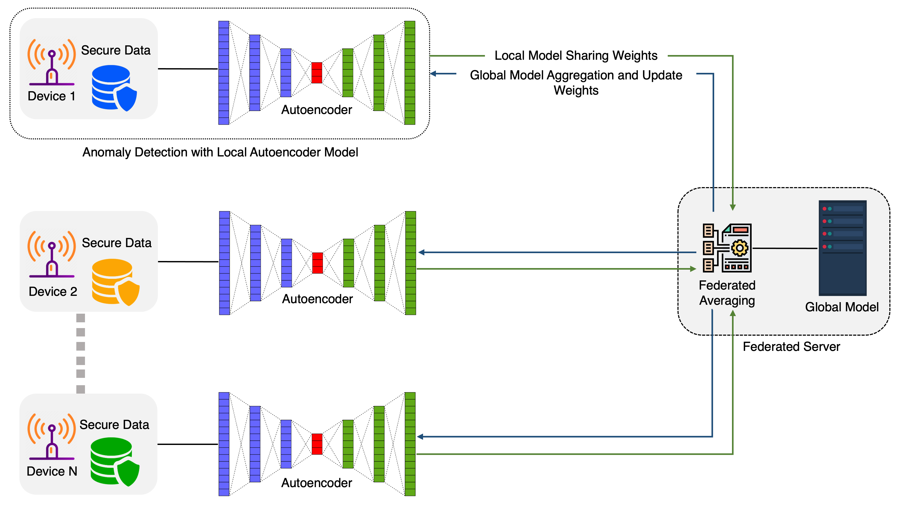

# Enhancing Anomaly Detection in Distributed Power Systems using Autoencoder-based Federated Learning

This is the offical implementation of the paper: \
**Enhancing Anomaly Detection in Distributed Power Systems using Autoencoder-based Federated Learning (In Reviewing)** \
Kimleang Kea, Youngsun Han, Tae-Kyung Kim

## Introduction
Due to the increasing IoT device usage in power systems, collecting and analyzing data have been difficult in terms of time consumption and data privacy. As a result, we present the FLAE to address these issues. In particular, we adopt an AutoEncoder-based (AE) model to detect abnormalities in IoT data that run inside each IoT device. In addition, with the Federated Learning (FL) approach, we collect each IoT device's model parameters and aggregate them inside the Federated Learning server, without needing to share data, while preserving the data privacy for each device. Our system is conducted in a single-machine simulation that means both FL server and clients are running inside a single machine. We hope FLAE could provide an efficient meaning for future development of Federated Learning.

<div align="center">
 
</div>

## Installation
This code needs Python-3.7 or higher.
```bash
pip3 install -r requirements.txt
```

## Dataset Preprocessing
Preprocess any datasets using the command
```bash
python3 preprocess.py ENERGY
```

To use SG filter on dataset, using the command
```bash
python3 preprocess.py ENERGY --filter
```
This will create another folder inside your dataset name called filtered.

## Centralized Learning
To run a model on a dataset, run the following command:
```bash
python3 main.py --model <model> --dataset <dataset>
```
where `<model>` can be either of 'AE', 'DAGMM', 'MAD_GAN', 'MSCRED', 'OmniAnomaly', 'USAD', and dataset 'ENERGY (Energy Consumption Data)'.

To run a model on a filtered dataset, run the following command:
```bash
python3 main.py --model <model> --dataset <dataset> --filter
```
It will produce error, if you don't have any filtered datasets.


## Federated Learning

This code will show you how Flower makes it very easy to run Federated Learning workloads.
We simulated the Federated Learning both server and clients on a single machine.

### Run the Federated Learning Server

To run the Federated Learning Server, using the command:
```
python3 fl_server.py --server_address localhost:11000 --model AE --dataset ENERGY &
```
- --server_address: specifies which server and port it runs on. E.g., localhost:11000
- --model: specifies which model to use. E.g., AE
- --dataset: specifies which dataset to test in this case we use ENERGY

After the FL server executed successfully, we can execute all clients to connect to server.

### Run the Federated Learning Clients

Before run the Federated Learning Clients, we must preprocess all of the data for each client. To do that, run the code in Jupyter Notebook which is called `client_preprocess.ipynb`.

To run the Federated Learning Clients, using the command:
```
# Run Client 1
python3 fl_client.py --server_address localhost:11000 --cid="dev1" --dataset ENERGY &

# Run Client 2
python3 fl_client.py --server_address localhost:11000 --cid="dev2" --dataset ENERGY &

# Run Client 3
python3 fl_client.py --server_address localhost:11000 --cid="dev3" --dataset ENERGY &

# Run Client 4
python3 fl_client.py --server_address localhost:11000 --cid="dev4" --dataset ENERGY &

# Run Client 5
python3 fl_client.py --server_address localhost:11000 --cid="dev5" --dataset ENERGY &

# Run Client 6
python3 fl_client.py --server_address localhost:11000 --cid="dev6" --dataset ENERGY &
```

After finished 20 rounds of training, the model file will be saved in checkpoints folder. We then can use that pre-trained model to evaluate its performance against the whole ENERGY dataset. The model performance result will be displayed in terminal console.


### DOI
[](https://zenodo.org/badge/latestdoi/515439963)
